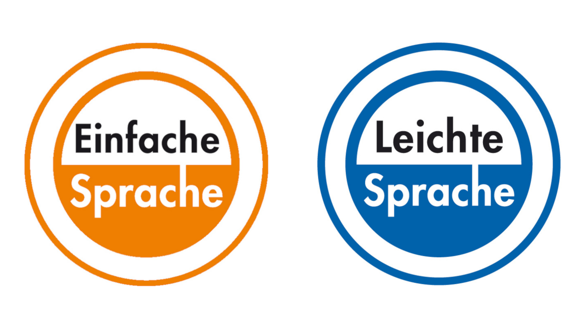

# Plain-Language Classification

## Repository Link

https://github.com/HannesMK/plain-language-classification

## Description

The project aims to classify whether a given German sentence is in plain language. Plain language is a form of language designed to express ideas in an accessible way. Key properties of plain language are that it is clear and concise and avoids jargon. The project leverages data presented in a recent paper by [Toborek et al. (2023)](https://doi.org/10.48550/arXiv.2209.01106). The dataset consists of articles scraped from the web for which parallel versions of plain and regular language exist. The datasets contains articles in both versions of plain German, namely Plain German ("Einfache Sprache") and the more strictly regulated Simple German ("Leichte Sprache"). During the course of the project, fairly basic deep-learning models proved to be able to already quite accurately distinguish between plain and regular language. However, a fine-tuned Transformer-based model was able to exceed this already high performance. Possible applications of the model trained here include the detection of violations of plain-language rules when trying to write texts in plain language.

### Task Type

Binary Text-Classification

### Results Summary

- **Best Model:** Fine-tuned German BERT
- **Evaluation Metric:** Accuracy
- **Result:** 93% Accuracy

## Documentation

1. [**Literature Review**](0_LiteratureReview/README.md)
2. [**Dataset Characteristics**](1_DatasetCharacteristics/exploratory_data_analysis.ipynb)
3. [**Baseline Model**](2_BaselineModel/baseline_model.ipynb)
4. [**Model Definition and Evaluation**](3_Model/model_definition_evaluation)
5. [**Presentation**](4_Presentation/README.md)

## Cover Image

